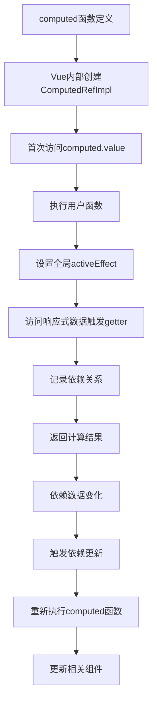

# CLAUDE.md

This file provides guidance to Claude Code (claude.ai/code) when working with code in this repository.

## Project Overview
这是link的Vue 3学习仓库，用于从传统前端开发(HTML+CSS+JS+jQuery)转向现代前端工程化开发。

## 当前学习进度

### 已完成 ✅
- **Node.js基础**: 理论学习和实践完成
  - 理解了Node.js vs 浏览器JavaScript的区别
  - 掌握了npm包管理系统概念
  - 完成了基础实践练习
  - 创建了详细教程: `01-nodejs-tutorial.md`

- **现代JavaScript语法**: 核心概念掌握
  - ES6+语法复习完成 (`practice.js`)
  - 深入理解Promise异步编程原理 (`promise-tutorial.md`)
  - 掌握async/await现代异步语法 (`async-await-tutorial.md`)
  - 理解JavaScript模块化机制 (`js-modules-tutorial.md`)
  - JavaScript number类型详解完成 (`js-number-demo.js`)
  - 从传统脚本开发转向现代工程化开发思维

- **JavaScript核心机制深度学习**: ✅ **2024-07-24完成**
  - **原型链继承**: 深度理解JavaScript继承机制，掌握Object.create()和call()方法
  - **String类型设计**: 掌握原始值+包装对象的双重设计，理解自动装箱机制
  - **Object.prototype根源**: 理解所有对象最终继承自Object.prototype的意义和获得的能力
  - **宿主环境对象**: 深入分析window/process等宿主对象，发现继承+组合设计模式
  - **装箱机制全解**: 完整分析String/Number/Boolean三种装箱机制的异同
  - **this绑定深度分析**: 从ES5痛点到ES6+优雅解决方案的完整理解
  - **技术文档产出**: 创建6个深度技术分析文档，已迁移至个人博客

- **前端工程化理解**: 概念转换完成
  - 理解传统前端 vs 现代工程化开发区别
  - 了解脚手架和构建工具的作用
  - 确定使用Vite作为构建工具
  - 理解打包、构建、热更新等概念

- **Vue 3学习准备**: 技术栈确定
  - 确认Vue 3 + Vite技术路线
  - 决定暂不学TypeScript，专注JavaScript版本
  - 理解Promise/async-await在Vue中的重要性
  - 掌握模块化在组件开发中的应用
  - **JavaScript基础扎实**: 已具备Vue开发所需的所有JavaScript核心知识

- **Vue 3实战项目完成**: ✅ **2024-07-24重大突破**
  - **项目创建**: 成功创建`my-first-vue-app`完整Vue 3项目
  - **项目结构理解**: 掌握index.html、main.js、App.vue等文件作用
  - **响应式数据**: 深度理解`ref()`创建响应式变量，数据驱动DOM更新
  - **事件绑定**: 掌握`@click`等Vue指令，告别手动DOM操作
  - **组件化开发**: 创建Counter.vue自定义组件，理解组件复用和作用域隔离
  - **Composition API**: 熟练使用`<script setup>`语法和computed计算属性
  - **热更新体验**: 深度体验Vite热更新，修改代码立即看到效果
  - **工程化流程**: 掌握npm run dev开发流程和现代前端工具链

### Vue 3核心概念完全掌握 🎉
JavaScript核心机制+Vue 3实战双重突破，已完成前端现代化转型：

- ✅ **思维转换成功**: 从DOM操作转向数据驱动开发
- ✅ **响应式理解**: ref()响应式数据 vs jQuery手动更新DOM
- ✅ **组件化开发**: 单文件组件.vue格式，组件复用和Props传递
- ✅ **现代工具链**: Vite构建工具，ES6模块化，热更新开发体验
- ✅ **Vue 3语法**: 模板语法、指令系统、Composition API完全掌握
- ✅ **项目文档**: 创建详细README.md，记录学习成果和最佳实践

- **Vue Router 4完全掌握**: ✅ **2024-07-27重大突破**
  - **基础路由**: 成功配置静态路由系统(`/`, `/about`, `/counter`)
  - **动态路由**: 掌握参数路由`/user/detail/:id`，理解URL参数获取
  - **嵌套路由**: ✅ **2025-08-04重大突破** - 从单独路由升级为企业级嵌套路由架构
    - **路由结构改造**: 将`/user/detail/:id`改造为`/user`父路由+`detail/:id`子路由
    - **children配置**: 掌握Vue Router children数组配置嵌套路由关系
    - **双层router-view**: 理解父组件`<router-view />`渲染子路由组件的机制
    - **界面设计**: 实现左右分栏布局，左侧用户列表+右侧动态内容区域
    - **响应式路由**: 掌握`useRoute()`响应式获取路由参数，实现路由状态指示
    - **项目重构**: 新增UserLayout.vue主布局组件和UserList.vue欢迎页面
  - **导航方式**: 熟练使用`<router-link>`声明式导航和`router.push()`编程式导航
  - **路由信息**: 掌握`useRoute()`获取当前路由状态和参数
  - **项目集成**: 成功将Vue Router集成到Vue 3项目，实现完整SPA体验
  - **文件组织**: 建立规范的`views/`文件夹结构，支持模块化组织
  - **最佳实践**: 理解路由懒加载、活跃链接样式、路由复用等核心概念

- **Pinia状态管理完全掌握**: ✅ **2025-07-30重大突破**
  - **安装配置**: 成功安装Pinia并配置到Vue 3项目(`npm install pinia`)
  - **Store创建**: 创建counter store，深度理解state/getters/actions三大核心概念
  - **状态响应式**: 掌握defineStore()定义store，state()返回响应式状态对象
  - **计算属性**: 理解getters作为store的computed，支持依赖其他getters
  - **异步Actions**: 掌握actions处理同步/异步逻辑，支持调用其他actions
  - **组件集成**: 改造Counter.vue使用Pinia store替代本地ref状态
  - **跨组件共享**: 创建GlobalCounter.vue演示多组件共享同一store状态
  - **路径别名**: 配置Vite路径别名@简化导入路径(`import { useCounterStore } from '@/stores/counter'`)
  - **ES Modules确认**: 深度理解ES Modules作为现代JavaScript模块化标准
  - **完整教程**: 编写详细的Pinia学习教程文档，记录核心概念和最佳实践

### Vue Router核心突破 🚀
**SPA单页应用理解**：
- ✅ **核心原理**: 理解URL变化但页面不刷新的机制(History API)
- ✅ **路由配置**: 掌握routes数组配置和createRouter()设置
- ✅ **动态参数**: 成功实现`/user/detail/:id`参数路由，支持用户详情页
- ✅ **嵌套路由架构**: ✅ **2025-08-04重大进展** - 企业级路由结构完全掌握
  - **双层路由体系**: `/user`主路由包含`detail/:id`子路由，实现模块化管理
  - **组件层次化**: UserLayout.vue主布局 → UserList.vue/UserDetail.vue子组件
  - **界面设计灵感**: 参考新闻详情页，实现左侧导航+右侧内容的经典布局
  - **用户体验优化**: 路由切换保持左侧列表状态，右侧内容动态更新
- ✅ **导航体验**: 无刷新页面切换，类似原生App的用户体验
- ✅ **项目架构**: 建立了完整的嵌套路由文件组织结构

### 声明式 vs 命令式编程深度理解 💡
**核心原理**: 声明式代码的更新性能消耗 = 找出差异的性能消耗 + 直接修改的性能消耗。如果能够最小化找出差异的性能消耗，就可以让声明式代码的性能无限接近命令式代码的性能。

#### 虚拟DOM的性能优化作用
- **目标**: 最小化"找差异"这一步的性能消耗
- **传统对比**: O(n³)复杂度 - 不可用于实际项目
- **虚拟DOM**: O(n)复杂度 - 使用启发式算法实现高效diff
- **编译优化**: 接近O(1) - Vue 3的静态提升和补丁标记

#### 多种优化策略对比
1. **虚拟DOM方案** (Vue 2/React)
   - 运行时diff算法优化
   - 保持灵活性但有内存开销
   
2. **编译时优化** (Vue 3)
   - 静态提升: 不变的元素编译时提取
   - 补丁标记: 只更新实际变化的部分
   - 结合虚拟DOM获得最佳性能

3. **编译完全消除** (Svelte)
   - 编译时分析依赖关系
   - 几乎不需要运行时diff
   - 接近原生命令式性能

#### 实际性能权衡
- **小更新**: 命令式可能更快 (无diff开销)
- **大批量更新**: 声明式优势明显 (批量优化)
- **开发体验**: 声明式大幅提升代码可维护性

**结论**: Vue 3通过编译时优化+虚拟DOM，在保持声明式开发体验的同时，实现了接近命令式的运行时性能，完美体现了"可维护性与性能并重"的设计理念。

### Pinia状态管理核心突破 🎯
**现代状态管理理解**：
- ✅ **核心理念**: 理解Pinia作为Vue 3官方推荐状态管理库的设计哲学
- ✅ **Store概念**: 掌握store作为全局状态容器，替代组件间复杂的props传递
- ✅ **响应式状态**: state()返回响应式对象，自动触发组件更新
- ✅ **计算属性**: getters提供基于state的派生数据，具备缓存特性
- ✅ **状态修改**: actions统一管理状态变更逻辑，支持同步异步操作
- ✅ **跨组件共享**: 多个组件可以共享同一store实例，实现状态同步

- **Vue 3响应式机制深度理解**: ✅ **2025-08-03重大突破**
  - **reactive()对象重新赋值问题**: 深度理解reactive()返回Proxy对象特性，掌握Object.assign()解决方案
  - **Vue 3最佳实践**: 
    - 对于整个对象替换：使用Object.assign(reactiveObj, newObj)保持Proxy引用
    - 对于部分属性更新：直接修改reactiveObj.property = newValue
    - 避免错误：不要使用reactiveObj = newObj直接重新赋值
  - **响应式原理洞察**: reactive()通过Proxy对象代理，重新赋值会破坏响应式连接
  - **实用解决方案**: Object.assign()是保持响应式的标准做法，在企业项目中广泛使用

- **Vue 3 computed()机制深度解析**: ✅ **2025-08-03重大突破**
  - **运行时机制理解**: computed不是编译时魔法，而是基于Proxy和依赖追踪的运行时实现
  - **响应式对象区别**: 
    - ref()返回RefImpl对象，通过getter/setter实现响应式
    - reactive()返回Proxy对象，通过Proxy handler实现响应式
  - **依赖收集精确机制**: 
    - computed内部执行用户函数时，通过全局activeEffect记录依赖关系
    - 当依赖变化时，Vue自动重新调用computed函数并更新计算结果
    - 依赖收集发生在computed函数执行期间，而非编译时
  - **完整工作流程**: computed接收用户函数 → 内部执行并记录依赖 → 依赖变化时重新调用 → 自动更新相关组件

- **技术博客产出**: ✅ **2025-08-03技术沉淀**
  - **vue3-reactive-reassignment.md**: Vue 3响应式对象重新赋值问题与最佳实践完整分析
  - **vue3-computed-deep-analysis.md**: Vue 3 computed响应式计算原理深度技术解析
  - **技术理解提升**: 从API使用层面深入到框架实现原理层面，建立了Vue 3响应式系统的完整认知

### 当前状态：Vue 3现代前端开发技术栈完全掌握 🚀
Vue 3 + Vue Router + Pinia技术栈完全整合，具备现代前端应用开发的全部核心能力！

**🎉 Vue 3响应式系统深度理解**: 已从API使用者升级为框架原理理解者，掌握了Vue 3响应式机制的底层实现原理。

**🏗️ 2025-08-04嵌套路由重大突破**: 
- 从基础单层路由升级为企业级嵌套路由架构
- 完成用户模块的完整重构：用户管理界面设计+路由层次化组织
- 掌握双层`<router-view />`渲染机制和响应式路由参数获取
- 实现了类似新闻网站的左侧导航+右侧内容的经典界面布局
- Vue Router学习从基础应用提升到企业级架构应用水平

- **Vue 3组件间通信方式深度掌握**: ✅ **2025-08-06重大突破**
  - **自定义事件vs函数传递**: 深度理解自定义事件的语义化优势和解耦能力
    - 自定义事件: 更清晰的语义表达，支持事件冒泡，更好的可维护性
    - 函数传递: 简单直接但耦合度高，适合简单场景
    - 最佳实践: 优先使用自定义事件，简单回调可使用函数传递
  - **Vue 3完整通信方式掌握**: 8种组件间通信方式完全理解
    - **父子组件通信**:
      - ✅ `props + emit`: 最基础和最重要的通信方式，单向数据流核心
      - ✅ `v-model`: 双向绑定语法糖，自动处理props和emit
      - ✅ `$attrs`: 透传属性，适合跨层级属性传递
    - **跨层级通信**:
      - ✅ `provide/inject`: 祖先向后代注入数据，避免props层层传递
    - **插槽通信**:
      - ✅ `作用域插槽`: 子组件向父组件传递数据，实现内容分发
      - ✅ `具名插槽`: 多个插槽位置，支持复杂布局组合
    - **全局通信**:
      - ✅ `Pinia`: Vue 3官方推荐状态管理，大型应用首选
      - ✅ `全局属性`: app.config.globalProperties，适合工具函数
      - ✅ `mitt事件总线`: 轻量级事件系统，适合简单全局通信
  - **通信方式优先级策略**: 建立了清晰的选择决策树
    - 父子组件: 优先props+emit → v-model双向绑定 → $attrs透传
    - 跨层级: provide/inject → Pinia全局状态
    - 兄弟组件: Pinia共享状态 → mitt事件总线
    - 复杂布局: 插槽系统(作用域插槽+具名插槽)
  - **组合使用实践**: 理解多种通信方式在复杂组件中的协调配合
  - **企业级最佳实践**: 掌握大型Vue应用中组件通信的架构设计原则

### 当前状态：Vue 3组件化开发完全掌握 🎉
**🚀 2025-08-06组件通信重大突破**: 
- Vue 3的8种组件间通信方式完全掌握，建立了完整的组件通信知识体系
- 深度理解各种通信方式的适用场景、优劣势对比和最佳实践
- 具备设计复杂组件交互架构的能力，为企业级Vue应用开发奠定坚实基础
- 标志着Vue 3组件系统的深度理解，从API使用者升级为架构设计者

### 下次继续 📋
- **Vue 3高级特性**: 基于深度理解的响应式系统，学习watch、watchEffect等高级响应式API
- **实战Todo应用**: 开发完整Todo应用，巩固Vue 3 + Router + Pinia + 组件通信技术栈整合
- **组件高级特性**: 动态组件、异步组件、组件缓存等高级用法
- **高级路由特性**: 路由守卫、权限验证、路由元信息等企业级应用需求
- **项目优化**: 组件懒加载、性能优化、构建部署等生产环境考量
- **Element Plus深度应用**: 基于组件通信知识，深度集成企业级UI框架

## Technology Stack

### 核心框架 (版本已固定 🔒)
- **框架**: Vue 3.4.29 (使用Composition API)
- **路由**: Vue Router 4.5.1 (官方路由管理器)
- **状态管理**: Pinia 3.0.3 (Vue 3官方推荐状态管理库)
- **构建工具**: Vite 5.3.1 (现代构建工具，比webpack简单)
- **包管理器**: npm (统一使用npm，不混用yarn)
- **HTTP客户端**: Axios 1.11.0 (异步请求库)

### UI框架选择
- **桌面端/后台管理**: Element Plus 2.10.5 (企业级后台管理系统首选) 🔒
- **移动端H5**: Vant 4 (Vue 3移动端开发首选框架) 🆕
- **学习项目**: 原生Vue 3组件 (专注核心概念学习)

### 代码规范与最佳实践 🎯
- **Vue 3 Composition API**: 严格使用 `<script setup>` 语法糖
- **路由**: 使用 `useRouter()` 和 `useRoute()` 组合式API
- **状态管理**: 使用 `defineStore()` 和组合式语法
- **Element Plus**: 全局注册，直接使用 `el-*` 组件
- **ES6+ 现代语法**: Promise/async-await、解构赋值、模板字符串
- **JavaScript专注策略**: 🚫 **不使用TypeScript** (2025-08-03决策)
  - 专注JavaScript，避免工具链复杂化
  - 严格使用 `.js` 和 `.vue` 文件，禁止 `.ts` 扩展名
  - Vue 3 + JavaScript已足够强大，保持学习专注度
- **Import规范**: 
  - 使用 `@/` 路径别名替代相对路径
  - 本地文件导入包含完整文件后缀
  - npm包导入保持标准格式

### 技术栈版本锁定策略 🔒
- **package.json版本固定**: 移除 `^` 符号，锁定具体版本
- **避免自动升级**: 确保开发环境一致性
- **学习项目稳定性**: 为Vue学习提供稳定的技术栈环境

## Development Setup
当项目初始化后，常用命令将包括：
```bash
npm install          # 安装依赖
npm run dev          # 启动开发服务器
npm run build        # 构建生产版本
npm run preview      # 预览构建结果
```

## Learning Path Context
这个项目专门用于学习现代前端工程化开发，重点关注：
1. **从jQuery到Vue 3的思维转换**: 从DOM操作转向数据驱动
2. **现代工程化工具**: Vite构建工具的使用
3. **Vue 3核心概念**: Composition API、单文件组件、响应式系统
4. **项目组织**: 标准Vue项目结构和最佳实践

## Code Style Guidelines
- 使用Vue 3 Composition API而非Options API
- 单文件组件(.vue)采用`<script setup>`语法糖
- 优先使用现代JavaScript特性(ES6+)
- 保持代码简洁易懂，适合学习理解
- **Import语句规范**:
  - 使用 @/ 路径别名替代相对路径引用（如 `@/views/Home.vue` 而不是 `../views/Home.vue`）
  - import语句必须包含完整的文件后缀（如 `@/stores/counter.js` 而不是 `@/stores/counter`）
  - npm包导入保持不变，Vue组件文件(.vue)保持明确后缀

### Vue 3编程最佳实践 🎯 (2025-08-03重要理解)
**Options API vs Composition API核心区别**：

#### Options API的弊端
- **功能逻辑分散**: 每个功能的data、methods、computed、watch被强制分散到不同选项中
- **维护困难**: 修改一个功能需要在多个地方查找和修改代码
- **逻辑不聚合**: 相关联的代码被物理分离，增加理解成本
- **复用性差**: 无法轻松提取和复用某个功能的完整逻辑

#### Composition API的优势
- **逻辑聚合**: 把相关联的功能的data、method、computed value都放在一起
- **易于维护**: 每个功能的所有代码集中管理，修改时只需关注对应的组合函数
- **高度复用**: 可以轻松在多个组件间共享功能逻辑
- **更好的类型支持**: 天然支持TypeScript类型推导

**link的编码最佳实践**: 始终保持功能相关的所有逻辑(数据、方法、计算属性)聚合在一起，这是现代组件开发的核心原则。

## 当前项目状态
- **环境已配置**: Node.js v24.4.1, npm v11.4.2
- **Vue 3 + Vue Router + Pinia完整应用**: `my-first-vue-app`项目已升级为现代前端完整应用
  - **项目结构**: 
    ```
    src/
    ├── App.vue                 # 根组件，包含导航栏和router-view
    ├── main.js                 # 入口文件，集成router和pinia
    ├── router/index.js         # 路由配置（含嵌套路由）
    ├── stores/                 # Pinia状态管理
    │   └── counter.js          # counter store定义
    ├── views/                  # 页面组件
    │   ├── About.vue
    │   ├── Counter.vue         # 集成Pinia store的计数器
    │   ├── GlobalCounter.vue   # 演示跨组件状态共享
    │   ├── Home.vue
    │   └── user/               # 用户模块（嵌套路由）
    │       ├── UserLayout.vue  # 用户模块主布局（左右分栏）
    │       ├── UserList.vue    # 用户管理欢迎页面
    │       └── detail.vue      # 用户详情页（动态路由）
    └── vite.config.js          # Vite配置（含路径别名@）
    ```
  - **开发服务器**: `npm run dev` 正常启动，访问http://localhost:5173/
  - **核心功能完成**: 
    - ✅ 静态路由 + 动态路由 + 声明式/编程式导航
    - ✅ **嵌套路由架构** (2025-08-04): 企业级路由结构完全实现
      - 双层router-view渲染机制，支持父子路由组件嵌套
      - 左右分栏界面设计，用户模块主布局+动态内容区
      - 响应式路由参数获取，实现活跃状态指示
    - ✅ Pinia状态管理 + 跨组件状态共享
    - ✅ 路径别名@配置 + ES Modules模块化
    - ✅ **Import语句规范化** (2025-08-01): 完成所有import语句标准化
      - 统一使用@/路径别名替代相对路径
      - 所有本地文件导入包含完整文件后缀
      - 提升代码可读性和维护性，符合现代前端最佳实践
  - **完整SPA体验**: 无刷新页面切换 + 全局状态管理，现代前端应用完整架构
- **学习资料状态**: 
  - **JavaScript深度分析文档已迁移**: 6个技术文档已迁移到个人博客 (`~/workspace/markdown/前端/js/`)
    - `js原型链继承图解.md` - 原型链继承机制详解
    - `js-string-type-design.md` - String类型双重设计分析
    - `js-object-prototype-analysis.md` - Object.prototype根源分析
    - `js-host-environment-objects.md` - 宿主环境对象继承关系
    - `js-primitive-boxing-analysis.md` - 装箱机制完整分析
    - `js-this-deep-analysis.md` - this绑定机制深度解析
  - **保留在项目中的实践代码**:
    - `node-basics.js` - Node.js基础概念演示代码
    - `practice.js` - ES6+语法练习文件（含原型链继承实例）
    - `hello.js` - 基础测试文件

## 开发工具配置状态
### VSCode配置
- 用户已下载Mermaid插件的VSIX文件，需要通过命令面板安装
- 安装方法: `Cmd+Shift+P` → `Extensions: Install from VSIX...`
- 安装完成后可以在Markdown预览中看到Mermaid流程图

### Vue DevTools调试工具 ✅
- **浏览器扩展**: 已安装Vue DevTools浏览器扩展 (Chrome/Firefox)
- **调试能力**: 可以实时查看组件状态、Vuex/Pinia状态、路由信息、性能分析
- **使用方式**: 在开发者工具中切换到Vue面板，自动检测当前页面的Vue应用
- **重要性**: 这是Vue开发的必备调试工具，大幅提升开发效率和问题排查能力

## V2net代理快速诊断 🔧 (2025-08-01)

**一键诊断命令**：
```bash
# 快速检查V2net是否正常工作
ps aux | grep -i v2net && lsof -i :1087 && curl -I --proxy http://127.0.0.1:1087 http://www.google.com
```

**快速修复流程**：
1. **检查V2net应用是否启动** - 桌面应用程序状态
2. **重启V2net** - 大部分问题的解决方案
3. **确认PAC模式** - 不要用全局代理模式

**快速测试代理**：
```bash
# 测试代理连接
curl -I --proxy http://127.0.0.1:1087 https://www.google.com

# 清除npm/git代理设置（避免冲突）
npm config delete proxy && npm config delete https-proxy
git config --global --unset http.proxy && git config --global --unset https.proxy
```

**常见问题**：
- V2net进程未运行 → 启动应用
- 端口未监听 → 重启V2net
- 特定网站无法访问 → 检查PAC规则

### 经验总结
**重要发现**：npm连接问题的根本原因是V2net代理服务未正常启动，而非配置问题。

**关键诊断步骤**：
1. **先检查进程状态**: `ps aux | grep v2net` - 发现进程不存在
2. **再检查端口监听**: `lsof -i :1087` - 确认端口未监听  
3. **最后验证连接**: `curl --proxy http://127.0.0.1:1087` - 证实代理不可用

**快速诊断命令组合**：
```bash
# 一行命令快速诊断V2net状态
ps aux | grep -i v2net && lsof -i :1087 && curl -I --proxy http://127.0.0.1:1087 http://www.google.com
```

**教训总结**：
- 代理问题优先检查服务本身是否运行，而非配置细节
- 系统性按层次排查：进程→端口→连接→配置
- V2net应用重启是解决大部分连接问题的有效方法

## Development Notes
- 这是学习项目，代码应该包含清晰的注释说明概念
- 每个功能实现后应该有对应的学习总结
- 优先实用性和理解性，而非复杂性
- 渐进式学习，先掌握核心概念再深入高级特性
- 用户喜欢通过Mermaid图表理解概念，应该多使用可视化说明

## 下次继续的任务
1. ~~**Vue Router实现单页应用路由**~~ ✅ **已完成 2024-07-27**
2. ~~**Pinia状态管理**~~ ✅ **已完成 2025-07-30**
3. ~~**Vue Router嵌套路由**~~ ✅ **已完成 2025-08-04** - 企业级路由架构完全掌握
4. **实战Todo应用**: 开发完整Todo应用，巩固Vue 3 + Vue Router + Pinia技术栈整合
5. **组件进阶**: 学习组件通信、插槽(slots)、动态组件等高级特性
6. **高级路由特性**: 路由守卫、权限验证、路由元信息等企业级应用需求
7. **项目优化**: 组件懒加载、性能优化、构建部署等生产环境考量

## JavaScript核心机制深度学习成果 (2024-07-24)
**🎉 重大突破**: 完成JavaScript核心机制深度分析，从语言设计层面理解JavaScript！

### 核心收获
- **原型链继承**: 深度理解继承机制，掌握Object.create()和call()的本质
- **类型系统**: 掌握装箱机制，理解原始值+包装对象的精妙设计
- **对象根源**: 理解Object.prototype作为所有对象根源的意义
- **设计模式**: 发现宿主环境对象的继承+组合设计模式
- **this绑定**: 从ES5痛点到ES6+优雅解决方案的完整掌握

### 文档产出
- **6个深度技术分析文档**: 已迁移至个人博客，作为长期技术参考
- **可视化图表**: 大量Mermaid流程图帮助理解复杂概念
- **实践代码**: 保留核心练习代码在项目中

### 学习意义
- **为Vue 3打下坚实基础**: 已具备现代前端开发所需的JavaScript核心知识
- **技术深度**: 不再停留在API使用层面，而是理解语言设计原理
- **准备充分**: 可以自信地开始Vue 3实战开发

**下一步**: 开始创建第一个Vue 3项目，将JavaScript知识应用到现代前端框架中！

## 虚拟DOM与组件深度理解 💡 (2025-08-01重大突破)

### 组件的本质理解
**组件就是一组DOM元素的封装** - 这句话是理解虚拟DOM描述组件的关键。组件通过函数封装内部逻辑和DOM结构，实现复用和作用域隔离。

### 虚拟DOM的两种描述方式

#### 1. 描述真实DOM元素
```javascript
// 直接描述真实DOM标签
{
  tag: 'div',
  props: {
    onClick: () => alert('hello')
  },
  children: 'click me'
}
// 对应真实DOM: <div onclick="...">click me</div>
```

#### 2. 描述组件
```javascript
// 用函数描述组件，函数返回值代表要渲染的内容
const MyComponent = function () {
  return {
    tag: 'div',
    props: {
      onClick: () => alert('hello')
    },
    children: 'click me'
  }
}
```

### 为什么用函数描述组件？🤔

#### 1. 动态性需求
```javascript
// 组件可以根据参数动态生成不同内容
const MyComponent = function(props) {
  return {
    tag: 'div',
    children: props.message  // 根据传入的props动态改变
  }
}

// 使用时可以传入不同参数
MyComponent({message: 'Hello'})  // 渲染 "Hello"
MyComponent({message: 'World'})  // 渲染 "World"
```

#### 2. 封装和复用
```javascript
// 组件可以包含内部状态和逻辑
const Counter = function() {
  let count = 0  // 组件内部状态
  
  return {
    tag: 'div',
    children: [
      { tag: 'span', children: `Count: ${count}` },
      { 
        tag: 'button', 
        props: { 
          onClick: () => {
            count++  // 点击后更新状态
            // 重新渲染
          }
        },
        children: '+1'
      }
    ]
  }
}
```

#### 3. 生命周期管理
```javascript
// 组件有从创建到销毁的完整生命周期
const MyComponent = function() {
  // 组件创建时执行初始化逻辑
  console.log('组件创建')
  const data = fetchData()
  
  return {
    tag: 'div',
    children: data
  }
}
```

#### 4. 作用域隔离
```javascript
// 每个组件函数都有独立的作用域，不会相互污染
const ComponentA = function() {
  const localVar = 'A的私有变量'
  return { tag: 'div', children: localVar }
}

const ComponentB = function() {
  const localVar = 'B的私有变量'  // 完全独立
  return { tag: 'div', children: localVar }
}
```

### 与Vue 3 Composition API的对应关系

在Vue 3中，`<script setup>`本质上就是这个思想的体现：

```vue
<script setup>
import { ref } from 'vue'

const count = ref(0)  // 组件内部状态
const message = 'Hello'  // 组件内部数据

function handleClick() {
  count.value++  // 组件内部逻辑
}
</script>

<template>
  <div @click="handleClick">
    {{ message }}: {{ count }}
  </div>
</template>
```

这相当于定义了一个组件函数，Vue会调用它来生成虚拟DOM。

### 核心设计理念总结

用函数描述组件体现了**函数式编程**的思想：

1. **动态性**: 相同输入产生相同输出，支持参数化
2. **封装性**: 组件内部状态和逻辑完全隔离
3. **复用性**: 同一个组件可以在多处使用，各自独立
4. **可预测性**: 纯函数特性让组件行为更容易理解和测试

这种设计让虚拟DOM既能描述静态的DOM元素，又能描述动态的、有状态的组件，为现代前端框架提供了强大的理论基础。

## Vue 3响应式系统深度解析 🔬 (2025-08-03重大突破)

### reactive()对象重新赋值问题深度理解
**核心问题**: reactive()返回的是Proxy对象，直接重新赋值会破坏响应式连接。

#### 错误做法 ❌
```javascript
const state = reactive({ name: 'old' })
// 这样做会破坏响应式！
state = { name: 'new' }  // 丢失了Proxy对象
```

#### 正确做法 ✅
```javascript
const state = reactive({ name: 'old' })
// 方法1: Object.assign保持Proxy引用
Object.assign(state, { name: 'new' })

// 方法2: 直接修改属性
state.name = 'new'
```

### computed()响应式机制深度解析
**核心发现**: computed不是编译时魔法，而是运行时基于依赖追踪实现。

#### 响应式对象的区别
- **ref()**: 返回RefImpl对象，使用getter/setter实现响应式
- **reactive()**: 返回Proxy对象，使用Proxy handler实现响应式

#### 依赖收集的精确时机


#### 完整工作流程理解
1. **函数接收**: computed接收用户定义的计算函数
2. **依赖收集**: 内部执行函数时通过activeEffect记录依赖
3. **变化监听**: 依赖的响应式数据变化时自动触发更新
4. **重新计算**: Vue重新调用用户函数获取最新计算结果
5. **组件更新**: 自动更新使用该computed的组件

### 技术理解意义
**从API使用者到框架原理理解者**: 
- ✅ 不再只是会用API，而是理解底层实现机制
- ✅ 能够预判哪些操作会破坏响应式，哪些是安全的
- ✅ 具备了调试复杂响应式问题的理论基础
- ✅ 为学习Vue 3高级特性(watch、watchEffect等)打下坚实基础

### 实践经验总结
- **Object.assign()**: 企业项目中保持响应式的标准做法
- **直接属性修改**: 简单场景的最佳选择
- **避免重新赋值**: 理解Proxy特性，避免破坏响应式连接
- **computed依赖**: 理解运行时依赖收集，不是编译时静态分析

## Element Plus UI框架集成 🎨 (2025-08-02)

### 问题解决：Element Plus样式不生效 ✅
**问题**: `ApiDemo.vue`中使用了Element Plus组件，但样式没有生效

**原因**: Element Plus未在`main.js`中正确引入和配置

**解决方案**: 在`main.js`中添加Element Plus全局配置
```javascript
import ElementPlus from 'element-plus'
import 'element-plus/dist/index.css'
// ...
app.use(ElementPlus)
```

### Element Plus配置状态
- ✅ **依赖已安装**: `package.json`中已包含`"element-plus": "^2.10.5"`
- ✅ **全局配置完成**: 已在`main.js`中正确引入ElementPlus和样式文件
- ✅ **样式验证成功**: Element Plus组件样式已正常生效，包括el-card、el-button、el-input、el-tag、el-alert等

### 重要开发约定 🚨
**Claude操作限制**: 
- ❌ 不要在Claude中执行`npm run dev`命令
- ✅ 配置完成后提醒用户手动测试
- ✅ 记录配置状态到CLAUDE.md文件

### 下一步测试步骤
1. 手动运行: `cd my-first-vue-app && npm run dev`  
2. 访问: http://localhost:5173/api-demo
3. 验证Element Plus组件(el-card, el-button, el-input等)是否正常显示样式
4. 确认所有Element Plus组件都有预期的UI效果

## 2025-08-05 工作进度记录 📋

### 每日仓库同步任务完成 ✅
**核心仓库同步状态**:
- **link-private-etc**: 推送了1个本地提交到远程仓库
- **learnVue**: 
  - 完成main.js代码优化：改进了链式调用的格式和注释结构
  - 成功提交并推送到远程仓库，commit消息规范化
- **markdown**: 仓库状态最新，无需同步操作

**仓库同步完成时间**: 2025-08-05 完成三个核心仓库的状态检查和必要同步

### 开发环境配置重要决策 🎯
**Cursor编辑器确认为Vue 3学习主工具**:
- **环境状态**: Cursor已完全配置就绪，具备Vue 3开发的所有必需条件
- **关键扩展**: Vue官方扩展(Volar 3.0.5)已安装，提供Vue 3语法高亮和智能提示
- **辅助工具**: IntelliJ IDEA键绑定、中文语言包等提升开发体验的扩展已就位
- **账号登录**: Cursor使用账号登录状态，具备AI辅助功能和配置同步能力
- **技术决策**: 明确后续Vue 3学习将完全基于Cursor环境进行

**配置验证结果**:
- ✅ Vue 3开发环境完全就绪
- ✅ 代码智能提示和语法检查功能正常
- ✅ AI辅助开发功能可用
- ✅ 配置在不同设备间同步

### 技术环境现状确认
**当前开发栈状态**:
- **Vue 3项目**: my-first-vue-app 已完成所有核心功能集成
- **编辑器**: Cursor(主要) + 其他编辑器(备用)
- **仓库管理**: 三个核心仓库同步流程已标准化
- **学习进度**: 已具备Vue 3现代前端开发完整技术栈

## 2025-08-06 学习进度记录 📋

### Vue 3组件间通信方式深度学习完成 ✅
**重大突破**: 完成Vue 3组件间通信的完整知识体系构建

#### 核心学习成果
- **自定义事件vs函数传递深度理解**:
  - 理解自定义事件的语义化优势: 清晰表达用户行为意图
  - 掌握解耦能力: 父组件只需监听事件，不关心子组件内部实现
  - 最佳实践策略: 优先使用自定义事件，简单回调可用函数传递

- **Vue 3完整通信方式掌握**: 8种组件间通信方式完全理解
  - **父子组件通信**: props+emit(核心) / v-model(语法糖) / $attrs(透传)
  - **跨层级通信**: provide/inject(依赖注入)
  - **插槽通信**: 作用域插槽+具名插槽(内容分发)
  - **全局通信**: Pinia(状态管理) / 全局属性 / mitt事件总线

- **通信方式优先级策略**: 建立清晰的选择决策树
  - 父子: props+emit → v-model → $attrs
  - 跨层级: provide/inject → Pinia
  - 兄弟: Pinia → mitt事件总线
  - 复杂布局: 插槽系统

#### 技术理解提升
- **从API使用者到架构设计者**: 具备设计复杂组件交互架构的能力
- **企业级最佳实践**: 掌握大型Vue应用中组件通信的架构设计原则
- **Vue 3组件系统深度理解**: 标志着Vue 3组件化开发的完全掌握

### 当前技术栈状态确认
- **Vue 3核心技术**: 响应式系统 + 路由系统 + 状态管理 + 组件通信 ✅ 完全掌握
- **开发工具**: Cursor编辑器 + Vue DevTools + Vite构建工具
- **项目状态**: my-first-vue-app 已具备企业级Vue应用的完整架构

### 下一步学习重点确认
基于完成的组件通信知识体系，下次学习重点：
1. **Vue 3高级响应式API**: watch、watchEffect等深度响应式特性
2. **实战Todo应用开发**: 整合所有已掌握技术栈的完整项目
3. **组件高级特性**: 动态组件、异步组件、组件缓存等
4. **Element Plus深度集成**: 基于组件通信知识的企业级UI框架应用
5. **保持仓库同步习惯** - 维护每日同步的工作流程

**学习里程碑**: Vue 3组件化开发知识体系已完整构建，具备开发企业级Vue应用的核心能力！
