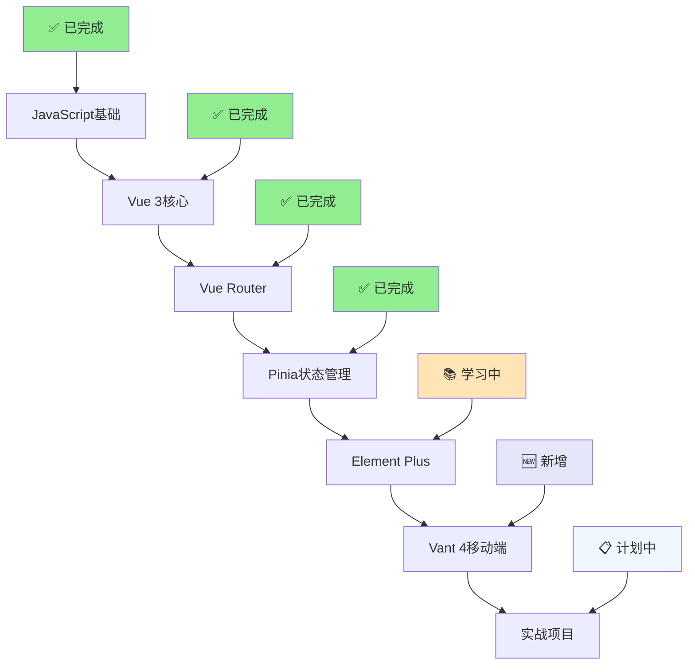

# Link的前端技术栈完整学习路线图

## 🎯 学习目标

从传统前端开发（HTML+CSS+JS+jQuery）完整转向现代前端工程化开发，掌握Vue 3生态系统的完整技术栈。

## 📊 当前学习进度总览



## 🎓 学习阶段详细规划

### 阶段一：JavaScript现代化转型 ✅ **已完成**

#### 1.1 JavaScript核心机制深度学习 (2024-07-24完成)
- ✅ **原型链继承机制** - 深度理解JavaScript继承设计
- ✅ **装箱机制全解** - String/Number/Boolean包装对象机制
- ✅ **this绑定分析** - 从ES5痛点到ES6+解决方案
- ✅ **宿主环境对象** - window/process等继承关系分析
- ✅ **技术文档产出** - 6个深度分析文档已迁移至个人博客

#### 1.2 现代JavaScript语法掌握 ✅ **已完成**
- ✅ **ES6+语法** - let/const、解构、箭头函数等
- ✅ **Promise异步编程** - 深入理解异步编程原理
- ✅ **async/await** - 现代异步语法糖
- ✅ **ES Modules** - 现代模块化系统
- ✅ **严格模式** - `'use strict'`强制使用

### 阶段二：Vue 3核心技术栈 ✅ **已完成**  

#### 2.1 Vue 3基础框架 (2024-07-24完成)
- ✅ **响应式系统** - ref()、reactive()数据驱动
- ✅ **Composition API** - `<script setup>`现代开发模式
- ✅ **组件化开发** - 单文件组件(.vue)格式
- ✅ **模板语法** - 指令系统、事件绑定
- ✅ **现代工具链** - Vite热更新、ES6模块化

#### 2.2 Vue Router 4路由管理 (2024-07-27完成)
- ✅ **SPA单页应用** - 无刷新页面切换体验
- ✅ **静态路由配置** - `/`, `/about`, `/counter`等基础路由
- ✅ **动态路由参数** - `/user/detail/:id`参数路由
- ✅ **导航方式** - `<router-link>`声明式 + `router.push()`编程式
- ✅ **路由信息获取** - `useRoute()`获取当前路由状态

#### 2.3 Pinia状态管理 (2025-07-30完成)
- ✅ **Store概念** - 全局状态容器替代props传递
- ✅ **状态响应式** - state()响应式状态对象
- ✅ **计算属性** - getters基于state的派生数据
- ✅ **异步Actions** - 统一管理状态变更逻辑
- ✅ **跨组件共享** - 多组件共享同一store实例

### 阶段三：企业级UI框架掌握 🔄 **进行中**

#### 3.1 Element Plus后台管理 📚 **学习中** (2025-08-02)
- 🔄 **安装配置** - Element Plus + Icons集成
- 📋 **布局系统** - Container、Header、Aside、Main
- 📋 **数据表格** - Table、Pagination数据展示
- 📋 **表单组件** - Form、Input、Select数据录入
- 📋 **导航组件** - Menu、Breadcrumb导航系统
- 📋 **反馈组件** - Message、Dialog用户反馈

#### 3.2 Vant 4移动端开发 🆕 **新增** (2025-08-02)
- 📋 **移动端适配** - 响应式设计、Touch事件
- 📋 **基础组件** - Button、Cell、Icon等
- 📋 **表单组件** - Field、Picker、DatePicker等
- 📋 **展示组件** - List、Card、Swipe等  
- 📋 **导航组件** - Tab、NavBar、Sidebar等
- 📋 **商业组件** - 购物车、商品卡片、支付等

### 阶段四：项目架构与实战 📋 **计划中**

#### 4.1 项目架构设计
```
前端项目完整架构：
├── my-first-vue-app/     # 🎓 学习实验项目
├── admin-backend/        # 💼 Element Plus后台管理系统  
└── h5-frontend/          # 📱 Vant 4移动端H5应用
```

#### 4.2 Admin后台管理系统 (优先开发)
- 📋 **用户权限管理** - 用户列表、角色管理、权限控制
- 📋 **内容管理系统** - 文章管理、分类管理、媒体库
- 📋 **数据统计面板** - 图表展示、数据可视化
- 📋 **系统设置** - 配置管理、日志查看

#### 4.3 H5移动端应用 (后续开发)
- 📋 **用户端界面** - 注册登录、个人中心
- 📋 **内容展示** - 商品列表、详情页面
- 📋 **交互功能** - 购物车、订单管理
- 📋 **移动端优化** - 性能优化、离线缓存

### 阶段五：高级特性与优化 🔮 **未来规划**

#### 5.1 Vue 3高级特性
- 📅 **组件通信进阶** - 父子通信、事件传递、插槽(slots)
- 📅 **动态组件** - Component、KeepAlive、Suspense
- 📅 **自定义指令** - 指令生命周期、指令参数
- 📅 **插件开发** - Vue插件机制、第三方集成

#### 5.2 路由高级功能
- 📅 **嵌套路由** - 复杂页面结构管理
- 📅 **路由守卫** - 权限验证、登录拦截
- 📅 **懒加载** - 路由级代码分割
- 📅 **路由元信息** - meta字段应用

#### 5.3 性能优化与部署
- 📅 **组件懒加载** - 按需加载优化
- 📅 **打包优化** - Vite构建配置优化
- 📅 **CDN部署** - 静态资源加速
- 📅 **Docker容器化** - 项目容器化部署

## 🛠️ 技术栈完整生态

### 核心技术栈
| 技术 | 版本 | 用途 | 掌握状态 |
|------|------|------|----------|
| **Vue** | 3.x | 前端框架 | ✅ 熟练 |
| **Vue Router** | 4.x | 路由管理 | ✅ 熟练 |
| **Pinia** | 2.x | 状态管理 | ✅ 熟练 |
| **Vite** | 5.x | 构建工具 | ✅ 熟练 |

### UI框架生态
| 框架 | 适用场景 | 掌握状态 | 优先级 |
|------|----------|----------|--------|
| **Element Plus** | 桌面端后台管理 | 📚 学习中 | ⭐⭐⭐⭐⭐ |
| **Vant 4** | 移动端H5应用 | 🆕 新增 | ⭐⭐⭐⭐ |
| **原生Vue组件** | 学习和验证 | ✅ 熟练 | ⭐⭐⭐ |

### 开发工具链
| 工具 | 用途 | 掌握状态 |
|------|------|----------|
| **npm** | 包管理器 | ✅ 熟练 |
| **ESLint** | 代码检查 | ✅ 熟练 |
| **Prettier** | 代码格式化 | ✅ 熟练 |
| **Docker** | 容器化部署 | 📋 已安装 |

## 📅 学习时间规划

### 近期目标 (2025-08)
- **Week 1**: Element Plus框架学习，创建Admin后台项目
- **Week 2**: 实现用户管理、数据表格等核心功能
- **Week 3**: Vant 4移动端框架学习，创建H5项目基础结构
- **Week 4**: 完善Admin后台功能，准备部署上线

### 中期目标 (2025-09)
- 完成Admin后台管理系统核心功能
- 开始H5移动端应用开发
- 学习高级路由特性和性能优化

### 长期目标 (2025-10+)
- 两个完整项目上线运行
- 掌握Vue 3生态系统高级特性
- 具备独立开发现代前端应用的能力

## 🎯 学习成果目标

### 技能掌握目标
1. **Vue 3生态系统完全掌握** - 框架+路由+状态管理
2. **双端UI框架熟练使用** - Element Plus + Vant 4
3. **现代前端工程化实践** - 从开发到部署的完整流程
4. **实战项目经验积累** - 后台管理系统 + 移动端H5应用

### 项目产出目标
1. **学习实验项目** - `my-first-vue-app` 技术验证平台
2. **企业级后台系统** - `admin-backend` 完整管理后台
3. **移动端H5应用** - `h5-frontend` 用户端应用
4. **技术文档库** - 完整的学习笔记和最佳实践

## 💡 学习方法与原则

### 学习方法
- **渐进式学习** - 先掌握核心概念，再深入高级特性
- **实践导向** - 每个概念都要有对应的代码实践
- **项目驱动** - 通过实际项目巩固学习成果
- **文档记录** - 详细记录学习过程和心得体会

### 开发原则  
- **现代化优先** - 使用最新的技术标准和最佳实践
- **工程化思维** - 注重代码质量、可维护性和扩展性
- **用户体验** - 重视界面交互和性能优化
- **团队协作** - 遵循代码规范，便于团队协作

---

**🚀 Link的前端现代化转型之路：从jQuery到Vue 3生态系统的完整掌握！**

*最后更新时间: 2025-08-02*