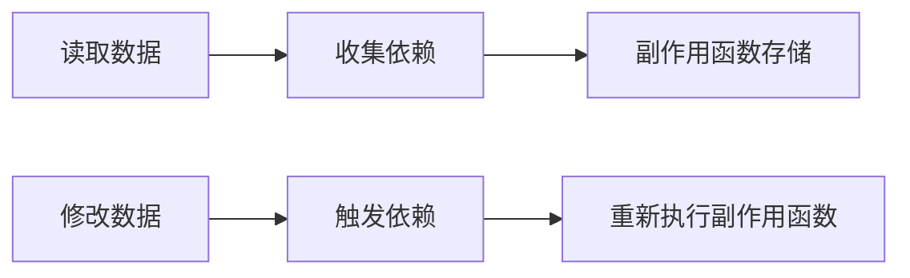
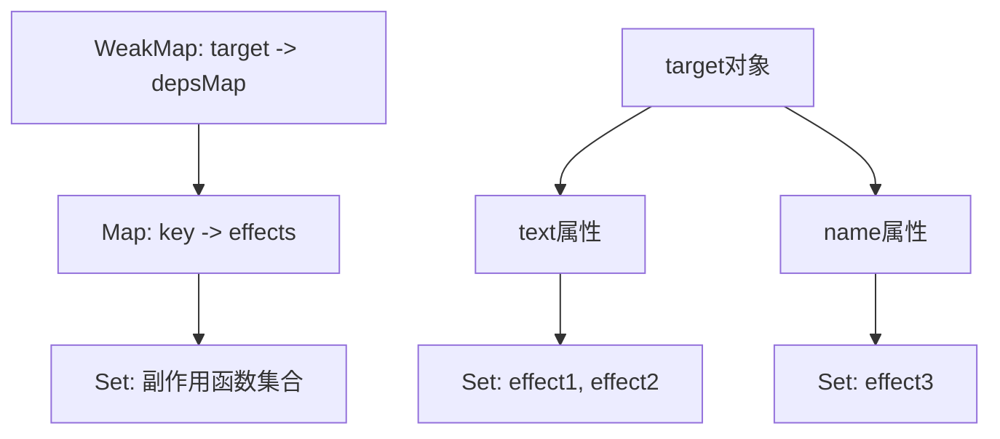
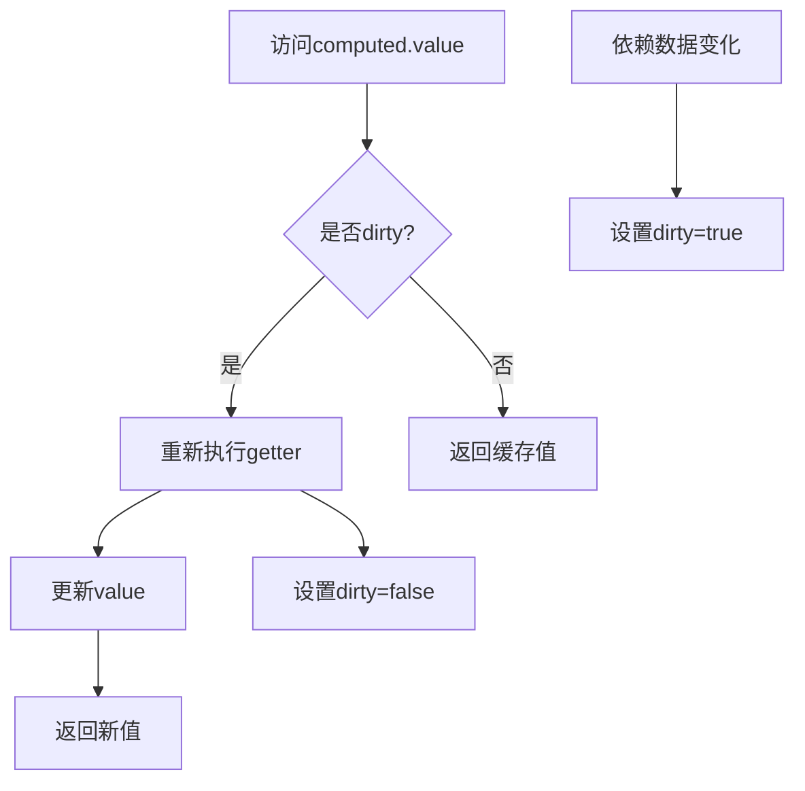

# Vue 3 响应式系统原理教程

## 🎯 学习目标

通过本教程，你将深入理解：
- Vue 3响应式系统的核心原理
- 从最简单的响应式实现到Vue 3的完整实现
- ref、reactive、computed的底层机制
- 依赖收集和依赖触发的完整流程

## 📚 目录

1. [什么是响应式系统](#什么是响应式系统)
2. [最简单的响应式实现](#最简单的响应式实现)
3. [完善的响应式系统](#完善的响应式系统)
4. [Vue 3的ref和reactive](#vue-3的ref和reactive)
5. [computed计算属性](#computed计算属性)
6. [实战演示](#实战演示)

## 什么是响应式系统？

**响应式系统**就是当数据发生变化时，依赖这些数据的地方能够自动更新。

### 传统方式 vs 响应式方式

```javascript
// 传统方式 - 手动更新
let price = 10
let quantity = 2
let total = price * quantity  // total = 20

price = 20
// total还是20，需要手动重新计算
total = price * quantity  // 手动更新 total = 40

// 响应式方式 - 自动更新
let price = ref(10)
let quantity = ref(2)
let total = computed(() => price.value * quantity.value)  // total = 20

price.value = 20
// total自动变成40，无需手动计算！
```

## 最简单的响应式实现

### 核心概念

Vue响应式系统的核心是**依赖收集**和**依赖触发**：



### 基础实现

```javascript
const bucket = new Set()
const data = { text: 'hello world' }

const obj = new Proxy(data, {
  get(target, key) {
    bucket.add(effect)
    return target[key]
  },
  set(target, key, newVal) {
    target[key] = newVal
    bucket.forEach(fn => fn())
    return true
  }
})

function effect() {
  console.log('执行副作用函数:', obj.text)
}
effect()  // 输出: 执行副作用函数: hello world
obj.text = 'hello vue'  // 输出: 执行副作用函数: hello vue
```

### 问题分析

这个基础实现有几个问题：

1. **硬编码副作用函数名**: 直接使用`effect`变量名
2. **无法处理多个副作用函数**: 只能收集一个函数
3. **没有精确的依赖关系**: 任何属性变化都会触发所有副作用函数

## 完善的响应式系统

### 解决硬编码问题

```javascript
// 全局变量，用于存储当前激活的副作用函数
let activeEffect

// 副作用函数注册器
function effect(fn) {
  activeEffect = fn
  fn()  // 执行副作用函数，触发依赖收集
}

const obj = new Proxy(data, {
  get(target, key) {
    // 使用activeEffect而不是硬编码的effect
    if (activeEffect) {
      bucket.add(activeEffect)
    }
    return target[key]
  },
  set(target, key, newVal) {
    target[key] = newVal
    bucket.forEach(fn => fn())
    return true
  }
})

// 使用方式
effect(() => {
  console.log('副作用函数1:', obj.text)
})
effect(() => {
  console.log('副作用函数2:', obj.name)
})
```

### 建立精确的依赖关系

问题：现在所有属性变化都会触发所有副作用函数，需要建立**属性与副作用函数的精确对应关系**。

```javascript
// WeakMap结构: target -> Map
// Map结构: key -> Set<副作用函数>
const bucket = new WeakMap()
const obj = new Proxy(data, {
  get(target, key) {
    if (!activeEffect) return target[key]
    
    // 根据target从bucket中取得depsMap，它是一个Map类型：key -> effects
    let depsMap = bucket.get(target)
    if (!depsMap) {
      bucket.set(target, (depsMap = new Map()))
    }
    
    // 再根据key从depsMap中取得deps，它是一个Set类型
    let deps = depsMap.get(key)
    if (!deps) {
      depsMap.set(key, (deps = new Set()))
    }
    
    // 最后将当前激活的副作用函数添加到deps中
    deps.add(activeEffect)
    
    return target[key]
  },
  
  set(target, key, newVal) {
    target[key] = newVal
    
    // 根据target从bucket中取得depsMap
    const depsMap = bucket.get(target)
    if (!depsMap) return true
    
    // 根据key取得所有副作用函数
    const effects = depsMap.get(key)
    
    // 执行副作用函数
    effects && effects.forEach(fn => fn())
    
    return true
  }
})
```

### 数据结构可视化



### 封装track和trigger函数

```javascript
// 依赖收集
function track(target, key) {
  if (!activeEffect) return
  
  let depsMap = bucket.get(target)
  if (!depsMap) {
    bucket.set(target, (depsMap = new Map()))
  }
  
  let deps = depsMap.get(key)
  if (!deps) {
    depsMap.set(key, (deps = new Set()))
  }
  
  deps.add(activeEffect)
}

// 依赖触发
function trigger(target, key) {
  const depsMap = bucket.get(target)
  if (!depsMap) return
  
  const effects = depsMap.get(key)
  effects && effects.forEach(fn => fn())
}

// 简化的Proxy实现
const obj = new Proxy(data, {
  get(target, key) {
    track(target, key)
    return target[key]
  },
  set(target, key, newVal) {
    target[key] = newVal
    trigger(target, key)
    return true
  }
})
```

## Vue 3的ref和reactive

### reactive实现

```javascript
function reactive(obj) {
  return new Proxy(obj, {
    get(target, key) {
      track(target, key)
      return target[key]
    },
    set(target, key, newVal) {
      target[key] = newVal
      trigger(target, key)
      return true
    }
  })
}

// 使用方式
const state = reactive({
  count: 0,
  message: 'hello'
})

effect(() => {
  console.log('count changed:', state.count)
})

state.count++  // 自动触发副作用函数
```

### ref实现

```javascript
function ref(val) {
  const wrapper = {
    value: val
  }
  
  // 添加__v_isRef标识，表示这是一个ref对象
  Object.defineProperty(wrapper, '__v_isRef', {
    value: true
  })
  
  return reactive(wrapper)
}

// 使用方式
const count = ref(0)

effect(() => {
  console.log('ref count:', count.value)
})

count.value++  // 触发更新
```

### ref vs reactive对比

| 特性 | ref | reactive |
|------|-----|----------|
| 数据类型 | 基本类型 + 对象 | 只能是对象 |
| 访问方式 | .value | 直接访问 |
| 底层实现 | 对象包装 + reactive | Proxy代理 |
| 使用场景 | 单一值、基本类型 | 复杂对象、多属性 |

## computed计算属性

### 基础实现

```javascript
function computed(getter) {
  let value
  let dirty = true  // 缓存标志
  
  const effectFn = effect(getter, {
    lazy: true,  // 懒执行
    scheduler() {
      dirty = true  // 数据变化时标记为脏数据
    }
  })
  
  const obj = {
    get value() {
      if (dirty) {
        value = effectFn()  // 重新计算
        dirty = false
      }
      return value
    }
  }
  
  return obj
}

// 使用方式
const sum = computed(() => {
  console.log('重新计算sum')
  return count.value + count2.value
})

console.log(sum.value)  // 第一次计算
console.log(sum.value)  // 使用缓存，不重新计算
count.value++           // 数据变化
console.log(sum.value)  // 重新计算
```

### computed的缓存机制



## 实战演示

我们将创建一个完整的demo来演示这些概念！

### 核心概念总结

1. **响应式的本质**: 数据变化 → 自动更新相关计算和视图
2. **依赖收集**: 在数据被读取时，记录哪些函数依赖了这个数据
3. **依赖触发**: 在数据被修改时，重新执行所有依赖这个数据的函数
4. **ref vs reactive**: ref适合基本类型，reactive适合对象
5. **computed**: 基于其他响应式数据的计算属性，具有缓存机制

### 学习路径建议

1. **理解概念**: 先理解响应式系统要解决什么问题
2. **实现简单版本**: 从最基础的Proxy实现开始
3. **逐步完善**: 解决硬编码、依赖关系等问题
4. **学习Vue 3 API**: 理解ref、reactive、computed的使用
5. **实践应用**: 在实际项目中使用这些API

接下来我们将创建可运行的demo代码！